```                         
                            ...                                               
                        :-++++++=-.                                           
                      .=+++++++++++-                                          
                     .++++++++++++++=     :------:                            :-:--.                 
                     :+++++++++++++++.  .----------                           #= .-+.                
                     :+++++++++++++++.  -----------:                         :#=  :#.                   
:--------------------------=++++++++-  .------------                          .=+  ++                
----------------------------+++++*+-.   :+=-----===:                          -+-.+:                 
:---------------------------++++=-.      .=+++++=-.                           .=+:.                    
:------=%%%%%%%%%%%%--------:...           .:::..                              -*=-:                
:------=****#@@#****--------=++++++++++++++-----------.                        -#++-                   
:----------:+@@+:-----------+++++++++++++++=-----------                        -#++-                  
:-----------+@@*------------+++++++++++++++=-----------.                       -*+*-                  
:-----------+@@*------------+++++++++++++++=-----------.                   .   -*++-                    
:-----------+@@*------------+++++++++++++++=-----------.                   --  -*++-                  
:-----------+@@*------------+++++++++++++++=-----------.           .       ==  -*++-                .=
:-----------+@@+------------+++++++++++++++=-----------.          .+       -=  :+==-                .*
:---------------------------+++++++++++++++=-----------.          =*       -=  -+=+=                .::
----------------------------+++++++++++++++=-----------           **       -+  -+=++.               .*=
.:-------------------------=+++++++++++++++=---------=:           #+       :=  ++-:*=                ==
                -++++++++++++++++++++++++++=-------=+=:          :#=       .:. *=: -*-               ==
                .=+++++++++++++++++++++++++*+++++++=-.           -#-        ::++=   :+=.            .==
                :++++++++++++++++++++++++=:.:::::.               -*:        .=+-.    .=+-.          -+:
                .=+*+++++++++++++++++++-                         -+-      .:-=.        .-====----:-==:
                    .-+**+++++++++++**+-.                        .++:   .-=-:             .:-====-:.
                    :-=++******+=-:                               .=+===--.                  
                        ..:::..                                      ...                     
                                    
                   _____                            ______  _      _       _                 
                  |_   _|                           | ___ \| |    (_)     | |                
                    | |  ___   __ _  _ __ ___   ___ | |_/ /| |__   _  ___ | |__    ___  _ __ 
                    | | / _ \ / _` || '_ ` _ \ / __||  __/ | '_ \ | |/ __|| '_ \  / _ \| '__|
                    | ||  __/| (_| || | | | | |\__ \| |    | | | || |\__ \| | | ||  __/| |   
                    \_  \___| \__,_||_| |_| |_||___/\_|    |_| |_||_||___/|_| |_| \___||_|   
                  
                    v1.2 developed by @Octoberfest73 (https://github.com/Octoberfest7)
```
# Introduction 
TeamsPhisher is a Python3 program that facilitates the delivery of phishing messages and attachments to Microsoft Teams users whose organizations allow external communications.

It is not ordinarily possible to send files to Teams users outside one's organization. Max Corbridge (@CorbridgeMax) and Tom Ellson (@tde_sec) over at JUMPSEC [recently disclosed a way to get around this restriction](https://labs.jumpsec.com/advisory-idor-in-microsoft-teams-allows-for-external-tenants-to-introduce-malware/) by manipulating Teams web requests in order to alter the recipient of a message with an attached file.

TeamsPhisher incorporates this technique in addition to [some earlier ones](https://posts.inthecyber.com/leveraging-microsoft-teams-for-initial-access-42beb07f12c4) disclosed by Andrea Santese (@Medu554).  

It also heavily leans upon [TeamsEnum](https://github.com/sse-secure-systems/TeamsEnum), a fantastic piece of work from Bastian Kanbach (@_bka_) of SSE, for the authentication part of the attack flow as well as some general helper functions.

TeamsPhisher seeks to take the best from all of these projects and yield a robust, customizable, and efficient means for authorized Red Team operations to leverage Microsoft Teams for phishing for access scenarios.

See the end of this README for mitigation recommendations.

# Features and demo
Give TeamsPhisher an attachment, a message, and a list of target Teams users. It will upload the attachment to the sender's Sharepoint, and then iterate through the list of targets.  

TeamsPhisher will first enumerate the target user and ensure that the user exists and can receive external messages. It will then create a new thread with the target user. Note this is technically a "group" chat because TeamsPhisher includes the target's email twice; this is a neat trick from @Medu554 that will bypass the "Someone outside your organization messaged you, are you sure you want to view it" splash screen that can give our targets reason for pause. **(v1.2)Note: this splash screen bypass was patched, but adding the target user to a group chat is still relevant to the current splash screen bypass.**

With the new thread created between our sender and the target, the specified message will be sent to the user along with a link to the attachment in Sharepoint.  

Once this initial message has been sent, the target user will be removed from the created group chat. This removes the sender's ability to further message the target, but it also removes the "This person is from outside your organization" splash screen and makes success much more likely. This current bypass was published by @pfiatde in [one of his many blogs concerning Teams and unintended behavior](https://badoption.eu/blog/2024/01/12/teams5.html) and integrated into TeamsPhisher by Steve Nelson (@stevesec128) and Alex Martirosyan (@almartiros) of DenSecure.  

## Operational mode
Run TeamsPhisher for real. Send phishing messages to targets.

Command:  
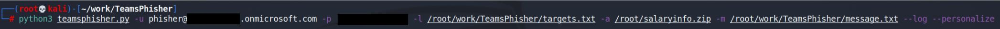

Targets.txt:  
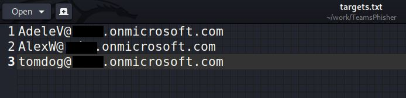

Message.txt:
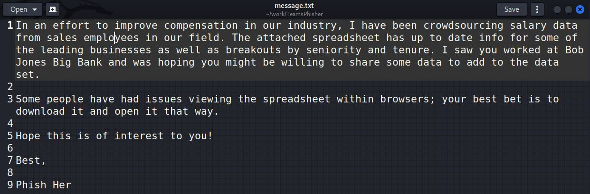

TeamsPhisher output:  
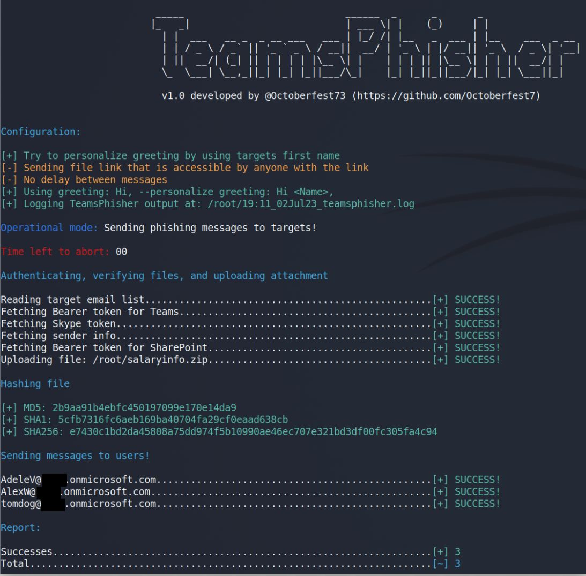

Sender's view:  
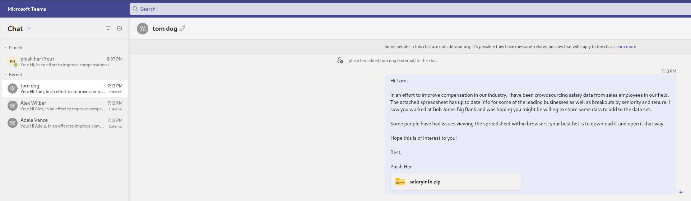

Targets view:  
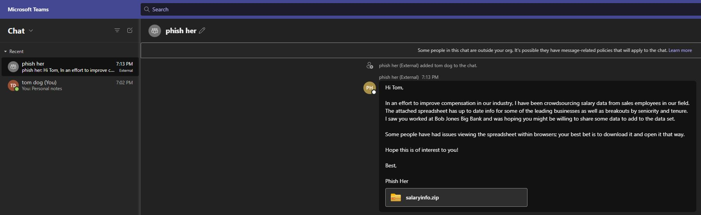

Attached file:  
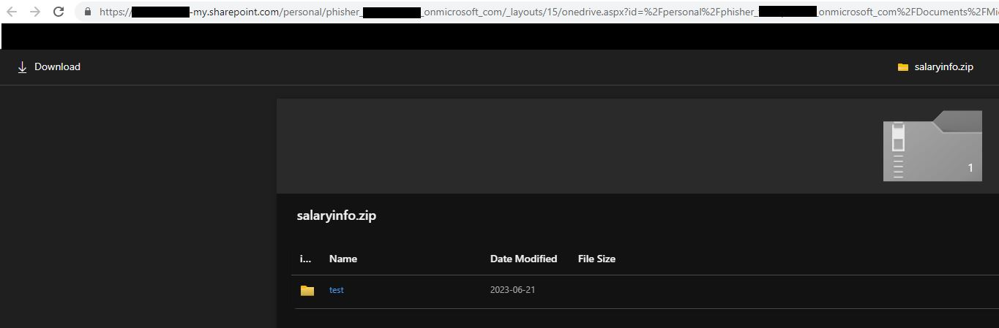

## Preview mode
Run TeamsPhisher in preview mode in order to verify your list of targets, preview their "friendly names" (if TeamsPhisher can resolve them using the --personalize switch), and send a test message to your own sender's account in order to verify everything looks as you want it.

TeamsPhisher output:  
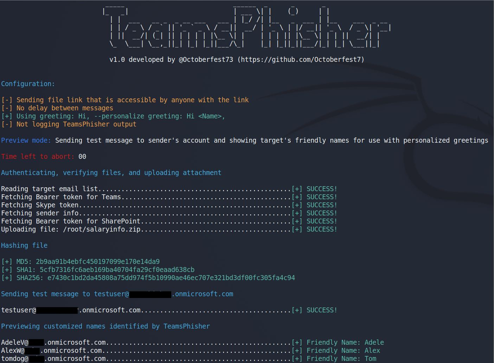

Sender's view:  
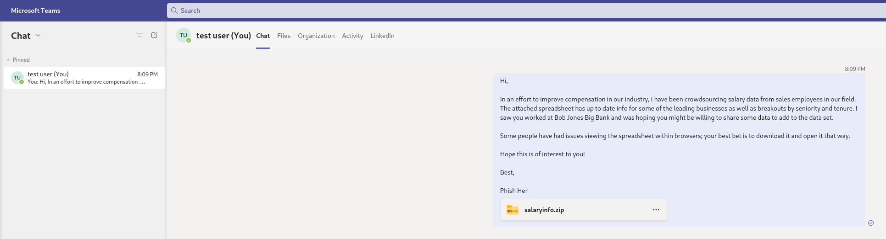

# Setup and Requirements
TeamsPhisher requires that users have a Microsoft Business account (as opposed to a personal one e.g. @hotmail, @outlook, etc) with a valid Teams and Sharepoint license.  

This means you will need an AAD tenant and at least one user with a corresponding license. At the time of publication, there are some free trial licenses available in the AAD license center that fulfill the requirements for this tool. 

You will need to log into the personal Sharepoint of the user you are going to be sending messages with at least once prior to using the account with TeamsPhisher. This should be something like tenantname-my.sharepoint.com/personal/myusername_mytenantname_onmicrosoft_com or tenantname-my.sharepoint.com/personal/myusername_mytenantname_mycustomdomain_tld. 

In terms of local requirements, I recommend updating to the latest version of Python3. You will also need Microsoft's authentication library:
```
pip3 install msal
```

# Usage 
```
usage: teamsphisher.py [-h] -u USERNAME -p PASSWORD -a ATTACHMENT -m MESSAGE (-e EMAIL | -l LIST) [--greeting GREETING] [--securelink] [--personalize]
                       [--preview] [--delay DELAY] [--nogreeting] [--log] [--sharepoint SHAREPOINT]

options:
  -h, --help            show this help message and exit
  -u USERNAME, --username USERNAME
                        Username for authentication
  -p PASSWORD, --password PASSWORD
                        Password for authentication
  -a ATTACHMENT, --attachment ATTACHMENT
                        Full path to the attachment to send to targets.
  -m MESSAGE, --message MESSAGE
                        A file containing a message to send with attached file.
  -e EMAIL, --targetemail EMAIL
                        Single target email address
  -s SHAREPOINT, --sharepoint SHAREPOINT
                        Manually specify sharepoint name (e.g. mytenant.sharepoint.com would be --sharepoint mytenant)
  -l LIST, --list LIST  Full path to a file containing target emails. One per line.
  --greeting GREETING   Override default greeting with a custom one. Use double quotes if including spaces!
  --securelink          Send link to file only viewable by the individual target recipient.
  --personalize         Try and use targets names in greeting when sending messages.
  --preview             Run in preview mode. See personalized names for targets and send test message to sender's Teams.
  --delay DELAY         Delay in [s] between each attempt. Default: 0
  --nogreeting          Do not use built in greeting or personalized names, only send message specified with --message
  --spoofile SPOOFILE   Spoof the type of file shown in Teams client. Any extension is allowed, but recommended options are: docx, xlsx, pptx and jpg.
  --log                 Write TeamsPhisher output to logfile
```

## Required arguments

### Username
The username of the Microsoft account you will be sending messages from (e.g. tomjones@mymadeuptenant.onmicrosoft.com)

### Password
The password for the aforementioned account. If it contains special characters, it may be helpful to wrap the whole thing in single quotes.

### Attachment
The file you wish to send to target users. This will be uploaded to the sending account's sharepoint and a link shared via Teams.

### Message
A file containing the text message that should accompany the attachment and be sent to targets

### Email / List
Either a single target email (e.g. mytargetsname@targettenant.onmicrosoft.com) or a file containing a list of target emails one per line.

## Optional arguments and features

### Sharepoint
Manually specify the name of the sharepoint site to upload the attachment to. **This will likely be necessary if your sender's tenant uses a custom domain name (e.g. does not follow the xxx.onmicrosoft.com convention)**. Specify just the unique name, e.g. if your sharepoint site is mytest.sharepoint.com you would use --sharepoint mytest

### Greeting
Override TeamPhisher's default greeting ("Hi, ") with a custom one to be prepended to the message specified by --message. For example, "Good afternoon, " or "Sales team, "

### Securelink
By default the sharepoint link sent to targets can be viewed by anyone with the link; use --securelink so that the sharepoint file is only viewable by the target who received it. May help protect your malware from Blue team.

### Personalize
TeamsPhisher will attempt to identify the first name of each target user and use it with the greeting. For example, tom.jones@targettenant.onmicrosoft.com would receive a message that started "Hi Tom, ". This is not perfect and is dependent on the format of the target emails; use --preview in order to see if this is a good fit for your target list or not.

### Preview
TeamsPhisher will run in preview mode. This will NOT send any messages to target users, but will instead display the "friendly" name that would be used by the --personalize switch. In addition, a test message representative of what targets would receive with the current settings will be sent to the sender's Teams; log in and see how your message looks and revise as necessary.

### Delay
Specify a x second delay between messages to targets. Can help with potential rate limiting issues.

### Nogreeting
Disable the built-in greeting used by TeamsPhisher. Also disables the --personalize feature. Use this option if you are including your greeting within the message specified by --message.

### Spoofile
Spoof the file type and extension shown in the Teams channel. Any provided extension is allowed, but recommended ones are: docx, xlsx, pptx, pdf and jpg.

### Log
Write TeamsPhisher output to a log file (will write to users home directory).

## Examples
```
python3 teamsphisher.py -u testuser@xxxxxxxxxxxx.onmicrosoft.com -p 'xxxxxxxxxxxx' -l /root/targets.txt -a /root/attachment.zip -m /root/message.txt --log
```

This command will fetch access tokens for the testuser account and upload the attachment '/root/attachment.zip' to testuser's Sharepoint.  

It will then create a unique Teams thread with each target listed within '/root/targets.txt' and send them the message specified within '/root/message.txt' as well as a link to the attachment within Sharepoint.  

All terminal output from TeamsPhisher will be logged in a file that is output within the user's home directory.

```
python3 teamsphisher.py -u testuser@xxxxxxxxxxxx.onmicrosoft.com -p 'xxxxxxxxxxxx' -l /root/targets.txt -a /root/attachment.zip -m /root/message.txt --greeting "Good afternoon" --personalize --securelink
```

This command will fetch access tokens for the testuser account and upload the attachment '/root/attachment.zip' to testuser's Sharepoint.

It will then create a unique Teams thread with each target listed within '/root/targets.txt' and send them the message specified within '/root/message.txt' as well as a link to the attachment within Sharepoint.  

The message will be prefixed with the greeting "Good afternoon <name>, ".

TeamsPhisher will try and use "friendly" names in the greeting. Now the greeting will be "Good afternoon <name>,".

Each SharePoint link sent is unique and valid only for that specific target.

# Additional Features and Commentary

## Account enumeration
TeamsPhisher will identify accounts that cannot be sent messages from external organizations, accounts that do not exist, and accounts that have a subscription plan that is not compatible with this attack vector:  

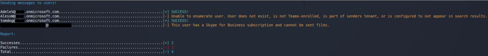

## MFA enabled accounts
Thanks to code from the TeamsEnum project, TeamsPhisher supports login with sender accounts using MFA:

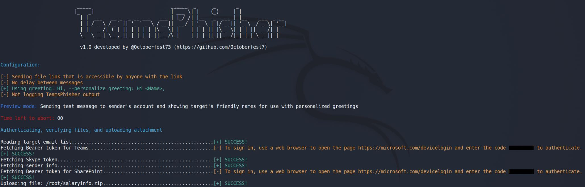


## Secure Sharepoint links
Using the --securelink switch will result in targets being prompted to authenticate in order to view the attachment in Sharepoint. You can decide if this adds too many extra steps, or if it adds 'legitimacy' by sending them through real Microsoft login functionality.

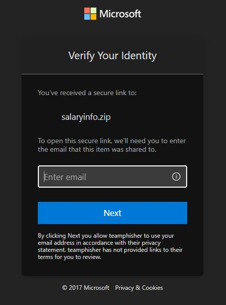

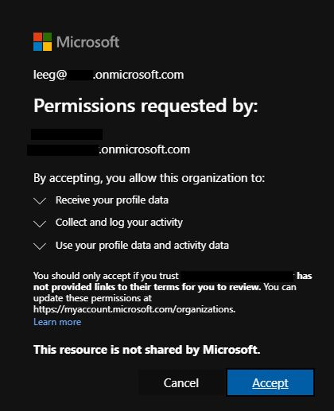

## Global variables

By editing TeamsPhisher.py you can alter a few global variables for use on subsequent runs:
```
## Global Options and Variables ##
# Greeting: The greeting to use in messages sent to targets. Will be joined with the targets name if the --personalize flag is used
# Examples: "Hi" "Good Morning" "Greetings"
Greeting = "Hi"

# useragent: The user-agent string to use for web requests
useragent = "Mozilla/5.0 (X11; Linux x86_64) AppleWebKit/537.36 (KHTML, like Gecko)"
```

## Personalization and "friendly" names

The --personalize flags will try to resolve a "friendly" name for each target; it does this by looking at the data returned by the enumUser function and first checking the "displayName" field.  

If the displayName field contains a space (e.g. "Tom Jones"), TeamsPhisher will split on the space and take the first chunk as the "friendly" name.

If there is not a space in the displayName field (e.g. some orgs might put the UPN in the displayName field like tom.jones@targettenant.onmicrosoft.com), TeamsPhisher will try and parse the UPN itself.

With an example UPN like tom.jones@targettenant.onmicrosoft.com, TeamsPhisher will split on the '@' character, and then in the first chunk split on the '.' character and take the first chunk. This would yield a "friendly" name of "Tom" in this case.

This is the extent of how TeamsPhisher will try and identify "friendly" names. Targets like "tomjones@targettenant.onmicrosoft.com" and "AdeleV@targettenant.onmicrosoft.com" will NOT have identified "friendly" names if their displayName fields do not match the parsing convention outline above.

# Mitigation

Organizations can mitigate the risk posed by this vulnerability by managing the options related to external access via the Microsoft Teams admin center under Users -> External access.

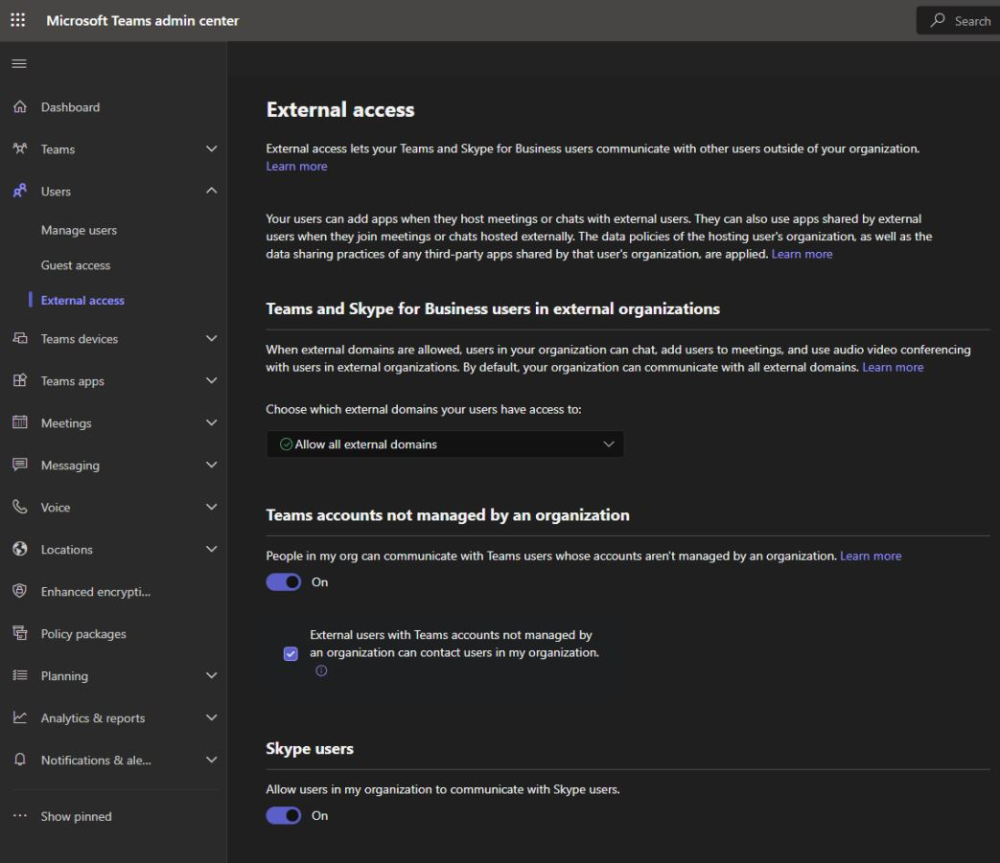

Microsoft provides flexibility to organizations to choose the best permissions to fit their needs, including a universal block as well as whitelisting only specific external tenants for communications.

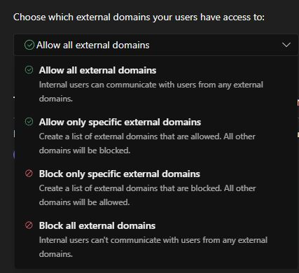

# Changelog  
## v1.2
Merges a pull request from the team at DenSecure that includes a working (as of 2/7/24) external user splash screen bypass.

The change to the TeamsPhisher workflow is luckily very minor and easy to integrate. After the group chat has been created with a target user and the message sent, an additional request is made to remove the target user from the group chat. This results in the user receiving the message without an external user splash screen.  

Update README with more current information regarding the technique currently used by TeamsPhisher.  

## v1.1.2
Fixed an error users were reporting in regards to uploading the attachment to Sharepoint; this stemmed from naming/renaming conventions that happen when users use custom domain with their tenants. 

Added a verification check to ensure that if users are using a NON @domain.onmicrosoft.com domain that they also use the -s switch in order to specify their sharepoint site manually to avoid issues.

Updated setup section to include logging into Sharepoint at least once prior to using TeamsPhisher as a user identified that not having logged in before with the account would cause TeamsPhisher to fail.

Added &top=999 parameter to getSenderInfo web request to increase the number of users retrieve per page/decrease number of requests required to find our user. 

### Reverse change regarding parsing of '.' in usernames when assembling Sharepoint uri
v.1.1 changed how usernames with the '.' character in them were parsed for the purposes of creating the requisite Sharepoint URI's. There were several distinct issues going on and I mistakenly identified this as the cause of one of them. This change has been reverted. The result is that a username like tom.jones@mytest.onmicrosoft.com will now have a sharepoint uri assembled as "tom_jones_mytest_onmicrosoft_com" rather than "tom.jones_mytest_onmicrosoft_com".  

## v1.1.1
Minor fixes  

## v1.1
There were a few commits made to address various small issues without incrementing the version number; sorry for being sloppy. 

v1.1 brings a few changes aimed at addressing some common issues that users were running into.

### -s, --sharepoint argument
This optional argument was added so that users can manually specify their sharepoint root name. A common issue arose when users had changed their tenant's domain name to something custom; e.g. rather than their username being tomjones@mytest.onmicrosoft.com, it might be tomjones@mytest.io. The original release of TeamsPhisher assembled the Sharepoint address and required uri paths by parsing the sender's user principal name from their user info. When a tenant's domain is changed to a custom one, user's UPNs change to reflect this. However the tenants sharepoint address will always remain the same/what they were when the tenant was originally created.

I wasn't able to find a good way to resolve the current Sharepoint address for a tenant; it can be done with Graph API easily, but implementing Graph in this tool would require a lot more setup on user's parts in order to use TeamsPhisher. I opted for providing the option to manually specify the sharepoint name as the easiest fix.

### Improved parsing of Sharepoint address and required uri when NOT using manual option
There was a report from a user who was NOT using a custom domain with their tenant who was still receiving the 404 not found error in regards to Sharepoint. I believe this had to do with their username containing a '.' e.g. tom.jones@mytest.onmicrosoft.com. The prior version of TeamsPhisher had simpler find + replace functionality for the user's UPN in order to assemble the requisite Sharepoint uri's, v1.1 now specifically targets the '.' characters that need to be replaced and will leave other '.' in the username field intact.

### Special characters (.e.g 'ö') within the message body no longer result in a server error
This was a very simple fix that took way too long to track down. Added utf-8 encoding to the sendFile POST request. Special characters can now be used in messages.

### Minor code cleanup
Fixed a few comments and re-ordered some steps in main to now check for requisite files before attempting to authenticate.  

## v1.0 - Initial release

# Credits and Acknowledgements 

1. Max Corbridge (@CorbridgeMax) and Tom Ellson (@tde_sec) of JUMPSEC for [this article](https://labs.jumpsec.com/advisory-idor-in-microsoft-teams-allows-for-external-tenants-to-introduce-malware/). Extra shoutout to Max for being very responsive and willing to chat privately about his research.

2. Andrea Santese (@Medu554) [for this research](https://posts.inthecyber.com/leveraging-microsoft-teams-for-initial-access-42beb07f12c4).  Again an extra shoutout for his responsiveness and being willing to discuss his work privately.

3. Bastian Kanbach (@_bka_) of SSE for [TeamsEnum](https://github.com/sse-secure-systems/TeamsEnum). This project served as a starting point for retrieving Bearer tokens and authenticating via different methods. I had used Graph API for these purposes, but his project (and this one) uses the normal endpoints so it was great having someone who had already fought through this and had reliable functions to accomplish it. 

4. @pfiatde who has a [many-part series on Teams phishing](https://badoption.eu/blog/2024/01/12/teams5.html). His blogs were referenced during the original development of TeamsPhisher, and the current version of the tool uses a new splash screen bypass from later research that he released.  

5. Steve Nelson (@stevesec128) and Alex Martirosyan (@almartiros) of DenSecure for their update to Teamsphisher (2/7/24) that integrated the still-working splash screen bypass from @pfiatde.  

6. [This site for generating ASCII text](https://patorjk.com/software/taag/#p=display&f=Graffiti&t=Type%20Something%20)

7. [This crazy project for converting images to ASCII art](https://github.com/TheZoraiz/ascii-image-converter)
